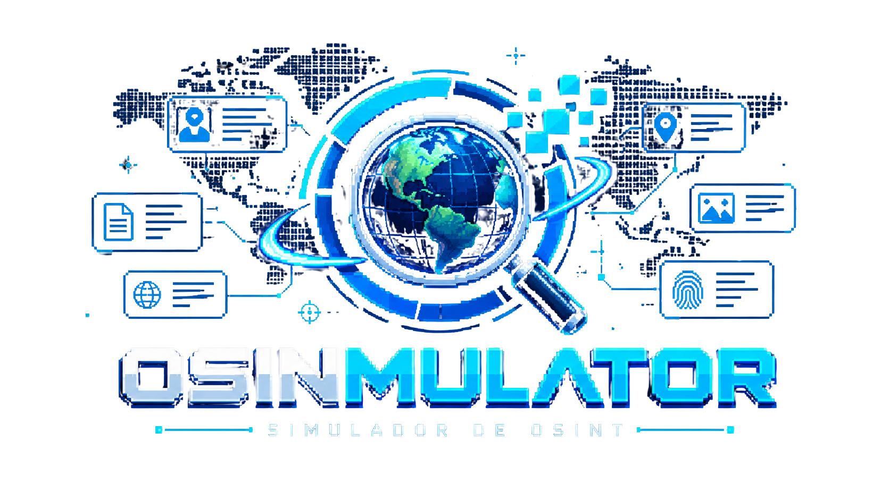

<div align="center">



### Observe · Correlacione · Investigue

**Uma experiência educativa que mostra, na prática, como posts comuns em redes sociais — somados — montam um dossiê perigoso sobre uma pessoa.**

<br>


</div>

> [!WARNING]
> **Tudo aqui é ficção.** A persona *Lia Andrade*, a cidade *Vila Serrana*, os apps, as fotos e todos os dados são **100% fictícios**. Nenhuma ferramenta real de ataque é executada — as "invasões" são apenas animações demonstrativas. O objetivo é **conscientização sobre privacidade**, não ensinar a atacar ninguém.

---

## 💡 A ideia

O público vira **investigador** e descobre, só com publicações públicas, tudo sobre a Lia. No fim, vê o estrago que essas pistas somadas podem causar — e, mais importante, **como cada pista poderia ter sido evitada**.

A estética fica no cruzamento de **CTF · investigação digital · threat intelligence · educação**: interface escura e técnica, com o smartphone colorido como contraste, e o neon usado como *recompensa visual* — nunca como decoração.

---

## 🧭 As três visões

Três visões independentes que compartilham **exatamente os mesmos dados**:

| Visão | Para quem | Onde | O que faz |
|-------|-----------|------|-----------|
| 🔍 **`?investigador`** | o público | celular | 3 apps fictícios, 9 missões de múltipla escolha, modo forense com pontuação/tempo e **dossiê final** com cards de evidência |
| 🖥️ **`?kali`** *(Analista)* | o palestrante | computador | terminal + painel de inteligência: reconstrói o dossiê, 4 ataques simulados, **grafo de conexões**, **linha do tempo** e **Modo Palestra** |
| 🎯 **`?atc`** *(Atacante)* | atacante jogável | computador | **9 passos de ataque** em múltipla escolha, placar e tempo, e o relatório da invasão |

> 🎲 **Dinâmica sugerida:** o público joga de `?investigador` e um voluntário joga de `?atc` ao mesmo tempo — um descobre as pistas, o outro mostra o que um atacante faria com elas.

---

## ✨ Destaques

- 📊 **Sistema de evidências** — cada pista vira um card com categoria, fonte, confiança e XP.
- 📽️ **Modo Palestra** — projeção em telão guiada pelas 9 missões (revelar pistas ao vivo, progresso e o reveal **`TARGET IDENTIFIED`**). Abre pelo botão **Projetar** no Analista; navega por setas/clicker.
- 🕸️ **Grafo de investigação** — pessoas, contas, locais, empresas e eventos conectados; clique num nó para isolar suas ligações e ver as correlações.
- ⏱️ **Linha do tempo** — a ordem em que as pistas foram reunidas, ótima para o palestrante revisar o processo.
- 👆 **Pistas clicáveis** — nos apps, elementos como local, horário, parentesco e nick abrem um popover explicando *o que aquela informação entrega*.
- 🎨 **Identidade visual por tokens** — paleta oficial num só arquivo; ícones vetoriais próprios; marca **OSINMULATOR**.

---

## 📱 As 3 redes fictícias

| App | Inspiração | Revela |
|-----|-----------|--------|
| **Fotogram** | Instagram | posts, locais, comentários de família |
| **CorreApp** | Strava | corridas com mapa, horários e rota (início/fim = casa) |
| **GameChat** | Discord | perfil, nick e mensagens com rotina/senha/viagem |

### As 9 pistas
`nome do pet` · `data de nascimento` · `nome da mãe` · `onde trabalha` · `rua onde mora` · `número da casa` · `rotina` · `período de viagem` · `senha provável`

---

## 🚀 Como rodar

Pré-requisitos: **Node.js 18+**

```bash
npm install     # instalar dependências
npm run dev     # ambiente de desenvolvimento
```

Depois abra:

| Visão | URL |
|-------|-----|
| Tela inicial | <http://localhost:5173/> |
| Investigador | <http://localhost:5173/?investigador> |
| Analista (Kali) | <http://localhost:5173/?kali> |
| Atacante | <http://localhost:5173/?atc> |

> 📲 Para testar no celular pelo mesmo Wi-Fi, use o endereço `Network` que o Vite mostra no terminal.

### Build de produção

```bash
npm run build     # gera a pasta dist/ (site estático)
npm run preview   # serve o build localmente
```

A pasta `dist/` é estática e pode ir para GitHub Pages, Netlify, Vercel, etc.

---

## ⌨️ Atalhos

**Analista (`?kali`)**

| Tecla | Ação |
|:-----:|------|
| `Enter` | Recon completo |
| `1`–`4` | Ataques simulados (senha · recuperação · engenharia social · mapa de risco) |

**Modo Palestra** (botão **Projetar**)

| Tecla | Ação |
|:-----:|------|
| `→` / `Espaço` | Revelar pista / avançar |
| `←` | Voltar |
| `R` | Recomeçar |
| `Esc` | Sair |

---

## 🎨 Identidade visual

Paleta oficial, centralizada em [`src/styles/tokens.css`](src/styles/tokens.css):

| | Uso | Hex |
|:-:|-----|-----|
| 🔵 | Azul principal | `#2B7FFF` |
| 🔷 | Ciano (brilho) | `#4FC3F7` |
| 🟣 | Roxo (acento) | `#7C5CFF` |
| 🟢 | Confirmado / sucesso | `#22C55E` |
| 🟡 | Suspeito / atenção | `#F59E0B` |
| 🔴 | Perigo / erro | `#EF4444` |
| ⚫ | Fundo | `#070B14` |

---

## 🧱 Tecnologias & estrutura

**Vite · React · TypeScript · CSS puro.** Sem back-end, sem bibliotecas de UI — tudo roda no navegador.

```
src/
  data/           persona, missions, attackMissions, graph  (FONTE ÚNICA dos dados)
  apps/           Fotogram · CorreApp · GameChat · Clue (pistas clicáveis)
  investigador/   fluxo do celular + modo forense + dossiê
  kali/           Analista: terminal, ataques e inteligência
  atc/            modo atacante jogável
  palestra/       Modo Palestra (projeção em telão)
  ui/             design system: ícones, Brand, EvidenceCard, Progress, grafo, timeline, categorias
  styles/         tokens (paleta oficial) + estilos por modo
imgs/             logo, letreiro e fotos fictícias
```

---

## 🗺️ Roadmap

**Concluído**

- [x] Identidade visual por tokens + ícones vetoriais
- [x] Sistema de evidências e indicadores de progresso
- [x] Modo Palestra + tela final `TARGET IDENTIFIED`
- [x] Grafo de investigação
- [x] Linha do tempo
- [x] Pistas clicáveis nos apps

**Próximos**

- [ ] Wallpaper do celular com pistas escondidas
- [ ] Feedback de descoberta em tempo real (toast de "nova evidência")
- [ ] XP cumulativo, ranking e múltiplos casos
- [ ] Editor de casos para palestrantes

---

## 🤝 Contribuições

**Contribuições são muito bem-vindas!** Abra uma *issue* ou um *pull request*. A ideia é que este projeto cresça com a comunidade e ajude cada vez mais gente a cuidar da própria privacidade.

## 📜 Licença e créditos

Uso **livre e gratuito** para fins educativos — e **com os devidos créditos**. **Venda ou qualquer uso comercial é proibido.** Leia os termos completos em [LICENSE.md](LICENSE.md).

<div align="center">

Criado por **Joabe Emanuel N. Kautnick** · [@JoabeEmanuelNKautnick](https://github.com/JoabeEmanuelNKautnick)

<sub>Observe · Correlacione · Investigue</sub>

</div>
